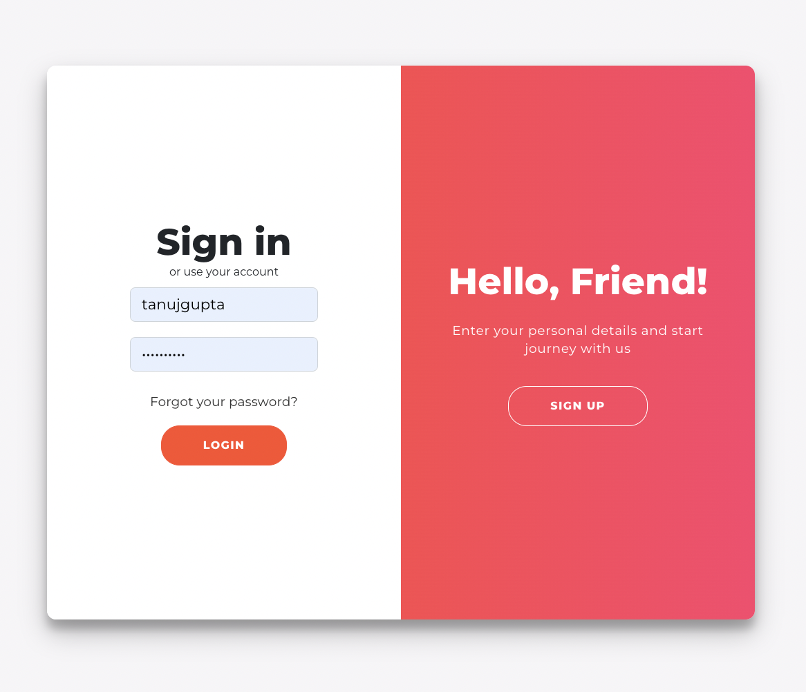
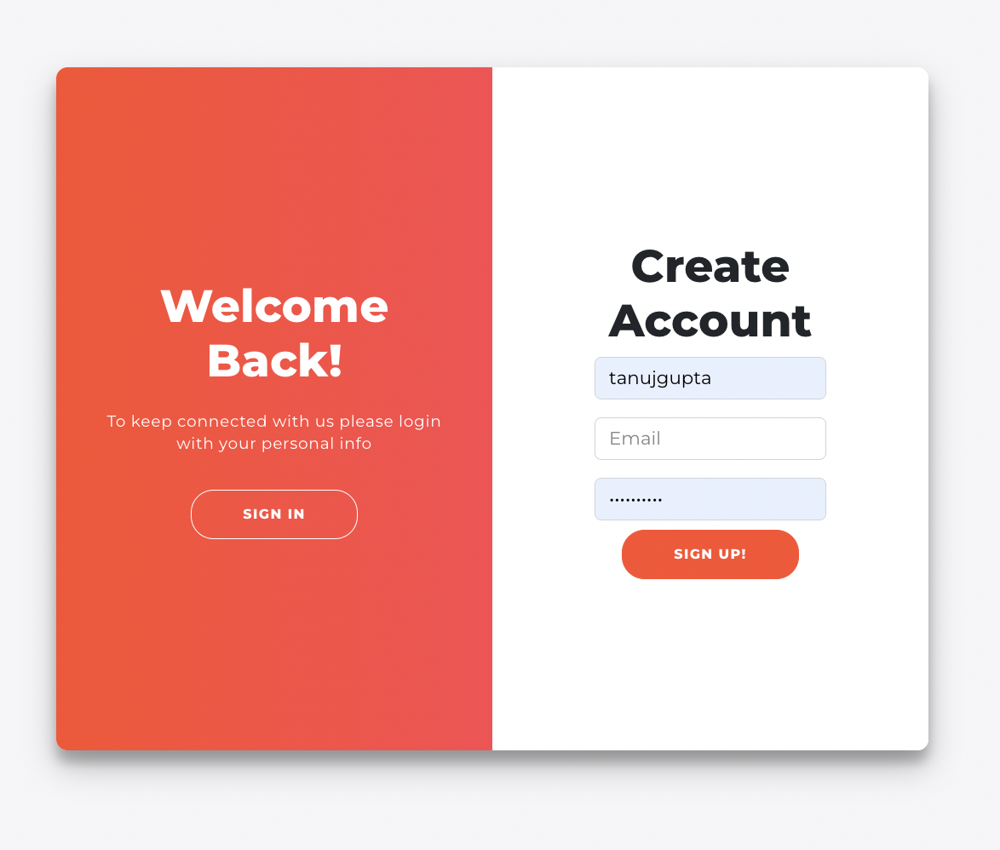
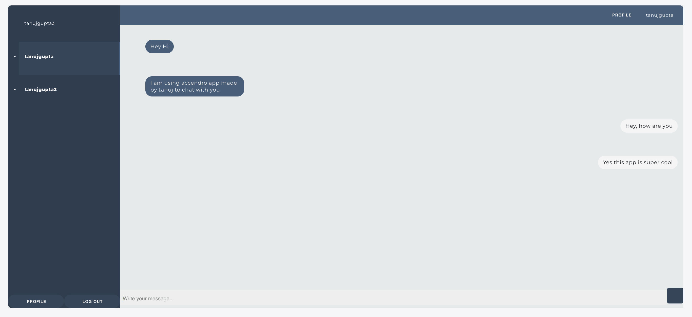
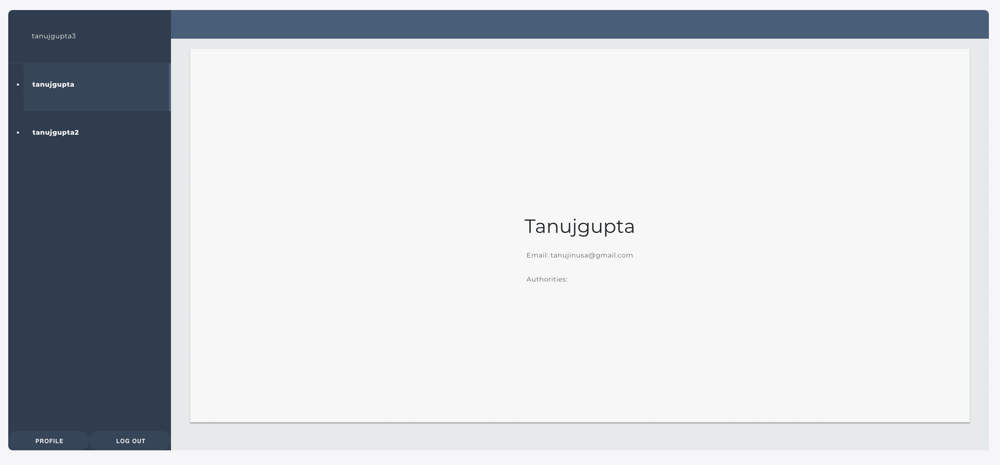

# full_stack_chat_application
One to one Chat application built using React Js and Spring Boot

# How to run all the services?

    #Steps:
    
    1. Clone this repository
    
    2. Go to root folder full_stack_chat_application
    
    3. To start all services in one go, run following command:
        
        docker-compose -f docker-compose.yml up -d

    4. To start individual services, run following command:

        #3.1 Backend Eureka Srvice service: 
        
            docker-compose -f ./Backend/EurekaService/EurekaService/Docker/docker-compose.yml up -d
        
        #3.2 Backend service 1 aka WebSocketChatService: 
        
            docker-compose -f ./Backend/WebSocketChatService/WebSocketChatService/Docker/docker-compose.yml up -d

        #3.3 Backend service 2 aka UserService: 
        
            docker-compose -f ./Backend/UsersService/UserService/Docker/docker-compose.yml up -d
        

        #3.4 Frontend react service: 
        
            docker-compose -f ./Frontend/accendro_chat_app_react/Docker/docker-compose.yml up -d

    5. Open URL http://localhost:3000/login_register to access web app chat application. 
    
PS: Please signup atleast 2 different accounts to be able to chat in application

PSS: Also, it may takes around 80-90 seconds for docker-compose to run all containers. Please wait for sometime for "http://localhost:3000/login_register" to run on browser after docker-compose is run.

# How to run tests:

    #1 Backend service 1 aka WebSocketChatService: 
        
        a) Go to folder ./Backend/WebSocketChatService/WebSocketChatService/
        
        b) run command: mvn clean install

    #2 Backend service 2 aka UserService: 
        
        a) Go to folder ./Backend/UsersService/UserService/
        
        b) run command: mvn clean install

    #3 Frontend react service: 
        
        a) Go to folder ./Frontend/accendro_chat_app_react
        
        b) run command: npm run test

# Features Added:
    
    1. Representing each stack resource as a container/image and being able to run the stack from docker-compose or some other automation.
    
    2. Logging and error handling
    
    3. Backend TESTING: Includes both Unit and integration test cases for both backend services
    
    4. Frontend TESTING: Includes both Unit and integration test cases for React App
    
    5. Eureka service registry aka microservice orchestration

# Frontend service
    # Frontend service 1: React Web App for Chat Service
    Frontend backend application for our chat application built using React JS
    
    # To Run This Service, type:
    docker-compose -f ./Frontend/accendro_chat_app_react/Docker/docker-compose.yml up -d

# Backend services
    # Backend service 1: Web Socket Service
        Authentication service for our backend application built using Spring Boot

        # APIs:
        http://127.0.0.1:8080/

            POST /chatApp/send
            {
                conversationId;
                messageString,
                private Date timestamp,
                private MessageState state,
                senderId,
                recieverId
            }
            

            GET /chatApp/{senderId}/{recieverId}/count
            {
                email,
                password,
                roles
            }

            GET /chatApp/{senderId}/{recieverId}/getMessages
            {
                email,
                password,
                roles
            }

        # To Run This Service, type:
        docker-compose -f ./Backend/WebSocketChatService/WebSocketChatService/Docker/docker-compose.yml up -d

        
    # Backend service 2: User Service
        Authentication service for our backend application built using Spring Boot

        # APIs:
        http://127.0.0.1:8081/

            POST /chat/security/log_in
            {
                usename,
                password
            }
            

            POST /chat/security/sign_up
            {
                email,
                password,
                roles
            }

            POST /chat/security/log_out
            {
                email,
                password,
                roles
            }

        # To Run This Service, type:
        docker-compose -f ./Backend/UsersService/UserService/Docker/docker-compose.yml up -d

# References:

    1. https://spring.io/guides/gs/service-registration-and-discovery/

    2. https://www.baeldung.com/spring-cloud-openfeign
    
    3. https://stackoverflow.com/questions/73947252/noclassdeffounderror-nestedioexception-when-running-tests-with-spring-boot-3-0

    4. https://blog.bitsrc.io/understanding-the-differences-between-unit-tests-and-integration-tests-in-react-component-8e51a1c8aa93

    5. https://stackoverflow.com/questions/53089122/issue-with-babel-jest-dependency-when-running-npm-start-in-a-react-app

    6. https://stackoverflow.com/questions/43500235/jest-mock-a-function-called-inside-a-react-component

    7. https://www.30secondsofcode.org/articles/s/testing-async-react-components/

    8. https://waresix.engineering/testing-your-react-component-with-react-testing-library-e40062abaf36

    9. https://www.bezkoder.com/react-redux-jwt-auth/

    10. https://www.baeldung.com/spring-boot-testing
    
    11. https://docs.spring.io/spring-security/reference/servlet/authentication/architecture.html

# Application Design:

    Login Page

    
    Sign Up Page

    
    Chat Page

    
    
    Chat Page Notification

    Profile on Chat

